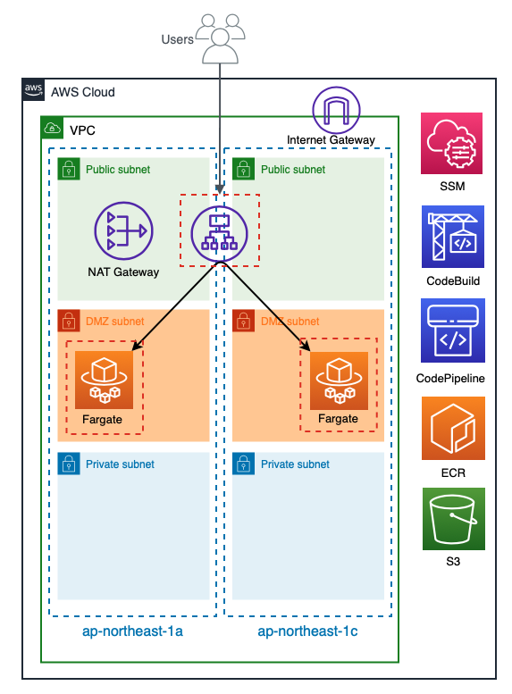

# AWS Fargate

## 0.ゴール
- AWS ECSを用いてFargateのタスクを起動し、ALBに対してブラウザからアクセスしたときにlaravelのページが表示される

## 1.前提
- インフラ構成の再利用性を高めるためTerraformを用いて構築します
    - https://www.terraform.io/
    - 動画撮影時の最新バージョン(v1.0.10)を利用しています
- AWSの認証情報やその他必要な環境変数を管理するためにdirenvを利用します
    - https://github.com/direnv/direnv
- 本動画で利用するコードは後日GitHubにて公開します
    - 動画の概要欄にリポジトリのURLを記載します

## 2.インフラ構成


## 3.インフラ構成詳細
- VPCは一つです
- サブネットを3つに分割して複数のAZを利用します
    - Public
        - InternetGatewayを介して外部から直接アクセスできる
        - ALBやNATGatewayを配置
    - DMZ
        - Publicからアクセスできる
        - Fargateのタスク(タスクとして起動するコンテナ)はここに配置
        - 外部から直接アクセスはできないがNATGatewayを介して外部と通信できる
    - Private
        - DMZからアクセスできる
        - 必要であればRDSなどのDBを配置する
        - 外部からアクセスできず通信することもできない
- セキュリティグループでアクセスを制限します
    - ALB用
        - HTTP(S)を任意の場所から全て許可
    - Fargate用
        - ALBのセキュリティグループをInboundの許可として追加
        - ALBからのリクエストを許可する
- Fargateと内訳として以下のリソースが作成されます
    - クラスター
    - サービス
    - タスク定義
        - Laravelを動かしたいのでNginxとPHPのコンテナを起動します

## 4.ディレクトリ構造

```            
.
├── .envrc
├── .gitignore
├── .terraform.lock.hcl
├── 00_provider.tf
├── 00_variables.tf
├── 01_vpc.tf
├── 02_securitygroup.tf
├── 03_alb.tf
├── 04_iam.tf
├── 05_fargate.tf
├── 06_codebuild.tf
├── 07_codepipeline.tf
├── 08_s3.tf
├── 09_ssm.tf
├── README.md
├── buildspec.yml
├── docker
│   ├── nginx
│   │   ├── Dockerfile
│   │   └── conf
│   │       ├── default.conf
│   │       └── nginx.conf
│   ├── php
│   │   └── Dockerfile
│   └── sites
│   │   └── 01_app
├── docker-compose-fargate.yml
├── docker-compose.yml
├── images
│   └── aws_fargate_infra.png
├── roles
│   ├── codebuild_assume_role.json
│   ├── codebuild_build_policy.json
│   ├── codepipeline_assume_role.json
│   ├── codepipeline_pipeline_policy.json
│   ├── fargate_task_assume_role.json
│   └── fargate_task_execution_policy.json
├── task_definitions
│   └── task_definition.json
├── terraform.tfstate
└── terraform.tfstate.backup
```

## 5.Dockerコンテナ起動確認(ローカル)
- docker-compose.ymlを元にDockerコンテナを起動する
- http://localhost/ にアクセスするとlaravelのページが表示される

```
# docker-compose up -d
# docker ps
```

## 6.Terraform実行

.envrcを作成する
```
export AWS_ACCESS_KEY_ID=XXXXXXXXXXXXXXXX
export AWS_SECRET_ACCESS_KEY=XXXXXXXXXXXXXXXX
export AWS_PROFILE=XXXXXXXXXXXXXXXX
export TF_VAR_role_arn=XXXXXXXXXXXXXXXX
export TF_VAR_github_repository_id=beyond-teraoka/terraform-aws-fargate-infra-example
export TF_VAR_github_access_token=XXXXXXXXXXXXXXXX
export TF_VAR_project=test
export TF_VAR_aws_account_id=XXXXXXXXXXXXXXXX
```

tfファイルを元にAWS上にリソースを作成する
```
# terraform apply
```

作成されるAWSリソース

- 01_vpc.tf
    - aws_eip.natgw
    - aws_internet_gateway.igw
    - aws_nat_gateway.natgw
    - aws_route.dmz
    - aws_route.public
    - aws_route_table.dmz
    - aws_route_table.private
    - aws_route_table.public
    - aws_route_table_association.dmz_1a
    - aws_route_table_association.dmz_1c
    - aws_route_table_association.private_1a
    - aws_route_table_association.private_1c
    - aws_route_table_association.public_1a
    - aws_route_table_association.public_1c
    - aws_subnet.dmz_1a
    - aws_subnet.dmz_1c
    - aws_subnet.private_1a
    - aws_subnet.private_1c
    - aws_subnet.public_1a
    - aws_subnet.public_1c
    - aws_vpc.vpc
- 02_securtygroup.tf
    - aws_security_group.alb
    - aws_security_group.fargate
    - aws_security_group_rule.allow_http_for_alb
    - aws_security_group_rule.egress_alb
    - aws_security_group_rule.egress_fargate
    - aws_security_group_rule.from_alb_to_fargate
- 03_alb.tf
    - aws_lb.alb
    - aws_lb_listener.alb
    - aws_lb_target_group.alb
- 04_iam.tf
    - aws_iam_role.codebuild_service_role
    - aws_iam_role.codepipeline_service_role
    - aws_iam_role.fargate_task_execution
    - aws_iam_role_policy.codebuild_service_role
    - aws_iam_role_policy.codepipeline_service_role
    - aws_iam_role_policy.fargate_task_execution
- 05_fargate.tf
    - aws_ecr_repository.nginx_app_01
    - aws_ecr_repository.php_app_01
    - aws_ecs_cluster.cluster
    - aws_ecs_service.service
    - aws_ecs_task_definition.task
- 06_codebuild.tf
    - aws_codebuild_project.project
- 07_codepipeline.tf
    - aws_codepipeline.pipeline
    - aws_codestarconnections_connection.codestar
- 08_s3.tf
    - aws_s3_bucket.pipeline
- 09_ssm.tf
    - aws_ssm_parameter.github_personal_access_token

## 7.リソース作成確認
- ECRが作成されていることを確認
    - https://ap-northeast-1.console.aws.amazon.com/ecr/repositories?region=ap-northeast-1
- ECSのクラスターが作成されていることを確認
    - https://ap-northeast-1.console.aws.amazon.com/ecs/home?region=ap-northeast-1#/clusters
- ECSのサービスが作成されていることを確認
    - https://ap-northeast-1.console.aws.amazon.com/ecs/home?region=ap-northeast-1#/clusters/cluster-fargate-test/services
- ECSのタスク定義が作成されていることを確認
    - https://ap-northeast-1.console.aws.amazon.com/ecs/home?region=ap-northeast-1#/taskDefinitions/task-fargate-test-laravel
- ALBが作成されていることを確認
    - https://ap-northeast-1.console.aws.amazon.com/ec2/v2/home?region=ap-northeast-1#LoadBalancers:search=alb-fargate-test;sort=loadBalancerName
- ALBに紐づくターゲットグループが作成されていることを確認
    - https://ap-northeast-1.console.aws.amazon.com/ec2/v2/home?region=ap-northeast-1#TargetGroups:search=fargate-test-tg

## 8.ECRに対してDockerイメージをアップロードする

Fargateのタスクとして起動するDockerイメージをビルドする
```
# docker-compose -f docker-compose-fargate.yml build
```

Dockerイメージの一覧を確認する    
nginxとphpのイメージがlatestタグで作成されていることがわかる
```
# docker images
```

AWS-CLIを利用してECRの認証情報を取得する    
ECRにイメージをアップロードするときに利用するため必ず実行する必要がある
```
# aws ecr get-login-password --region ap-northeast-1 | docker login --username AWS --password-stdin ${TF_VAR_aws_account_id}.dkr.ecr.ap-northeast-1.amazonaws.com
```

ECRにアップロードする
```
# docker push ${TF_VAR_aws_account_id}.dkr.ecr.ap-northeast-1.amazonaws.com/fargate-${TF_VAR_project}-nginx-app-01:latest
# docker push ${TF_VAR_aws_account_id}.dkr.ecr.ap-northeast-1.amazonaws.com/fargate-${TF_VAR_project}-php-app-01:latest
```

## 9.Fargateタスク起動確認
- ECSのタスクが起動(RUNNING)していることを確認
    - https://ap-northeast-1.console.aws.amazon.com/ecs/home?region=ap-northeast-1#/clusters/cluster-fargate-test/tasks
- ALBのターゲットグループにFargateのタスクが紐づいていることを確認
    - https://ap-northeast-1.console.aws.amazon.com/ec2/v2/home?region=ap-northeast-1#TargetGroups:search=fargate-test-tg

## 10.動作確認(ALB経由)
- http://{ALBのDNS名} でLaravelのページが表示されればOK

## 11.お片付け

作成したAWSリソースを削除する
```
# terraform destroy
```

## 12.追加実装(課題)
- 2つめのアプリケーションを追加します
    - ./docker/sites/02_appを作成してください
    - ./docker/sites/02_app/public/index.phpを配置しphpinfoを出力するコードを記述してください
    - http://localhost:8080 にアクセスしたときに02_appのページ(phpinfo)が表示されるようにしてください
- 2つめのアプリケーションを稼働させるAWSリソースを追加します
    - Terraformのコードに追記を行ってください
    - http://{02_app用のALBのDNS名} でアクセスした際に02_appのページ(phpinfo)が表示されるようにしてください